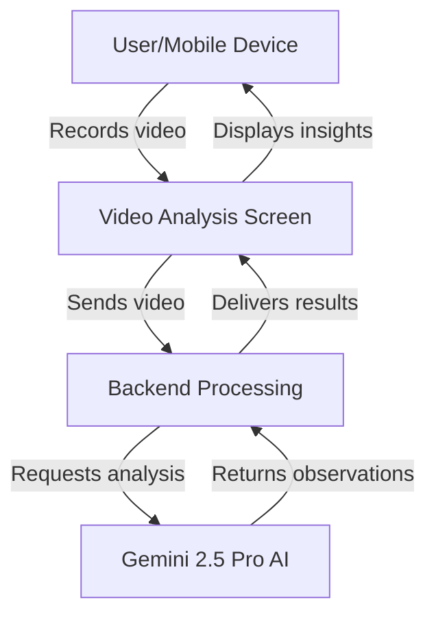
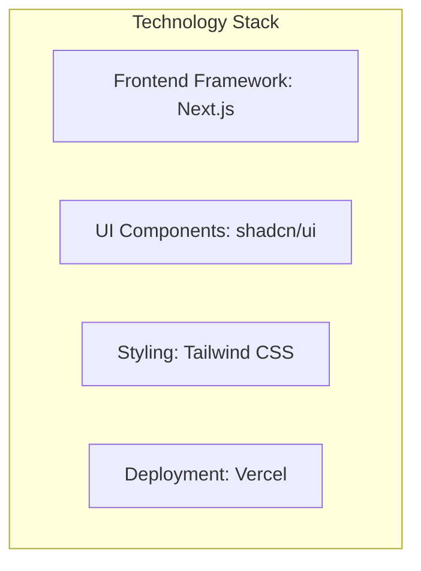

# AI Video Analysis Application Architecture

## Simple Flow

1. User records video using their mobile device
2. Video is sent to the backend for processing
3. Backend communicates with Gemini 2.5 Pro for AI analysis
4. AI identifies maintenance and cleanliness issues
5. Results are returned to the user interface
6. User views analysis with highlighted observations

## Key Features

- Mobile-optimized video recording
- AI-powered analysis of maintenance and cleanliness issues
- Sentiment analysis (positive/negative observations)
- Timestamp-based insights
- User verification of AI observations

## Technology Stack

- **Framework**: Next.js for both frontend and API routes
- **UI Components**: shadcn/ui component library
- **Styling**: Tailwind CSS for responsive design
- **Deployment**: Vercel for seamless deployment and hosting
